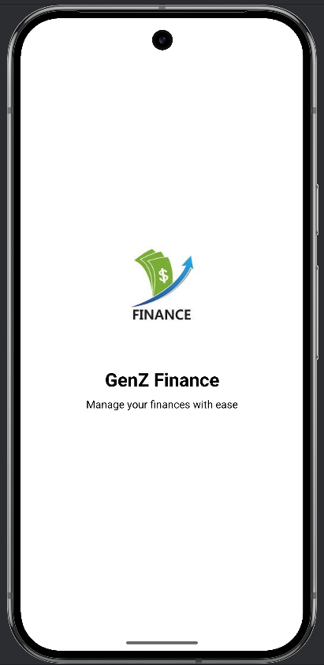
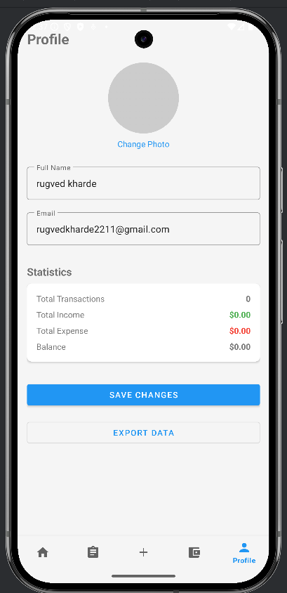
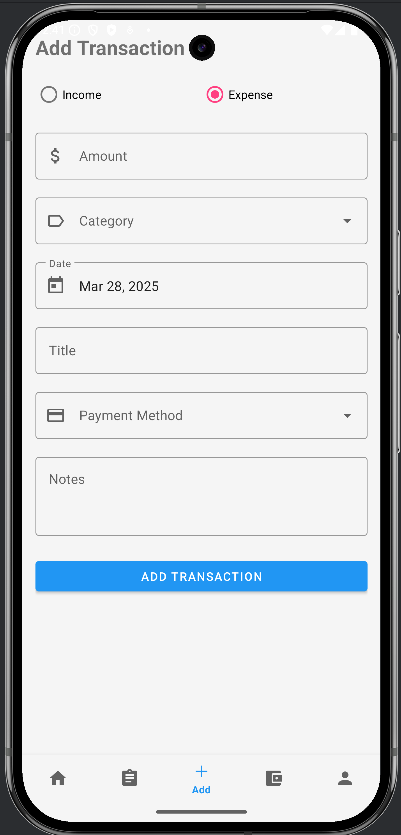
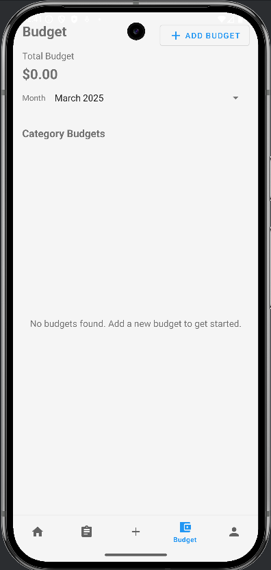
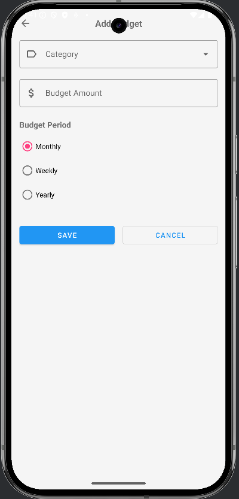
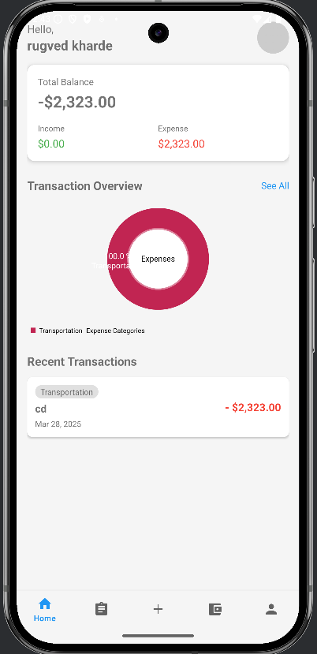
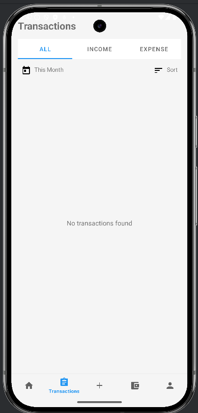
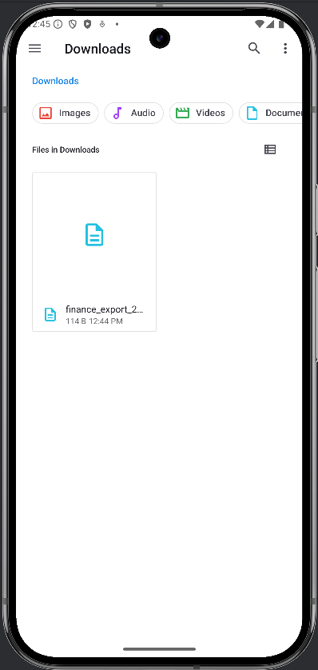

# Genz Finance App Screenshots

The following screenshots showcase the main screens and functionality of the Genz Finance application:

## Splash Screen

The splash screen displays when the app is launched, featuring the Genz Finance logo and branding.

## Profile Management

The profile management screen allows users to update their personal information, change their profile picture, and adjust app settings.

## Add Transaction

This screen provides an intuitive form for users to add new income or expense transactions with categories, amounts, dates, and descriptions.

## Budget Overview

The budget overview screen displays all created budgets with progress bars showing utilization rates for each category.

## Add Budget

This screen allows users to create and configure new budget items by category, amount, and time period.

## Dashboard

The main dashboard provides a comprehensive overview of the user's financial status, including balance, recent transactions, and spending visualizations.

## Transaction Home

This screen displays a chronological list of all transactions with filtering capabilities and detailed information.

## Data Export Confirmation

The confirmation screen appears after a successful data export operation, confirming that financial data has been exported. 